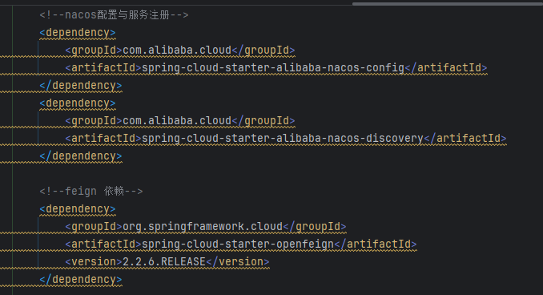
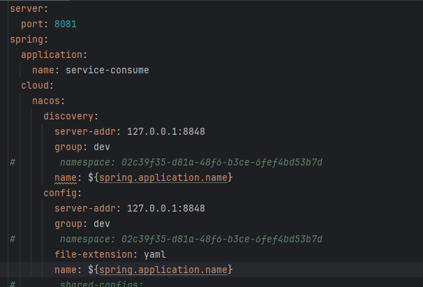
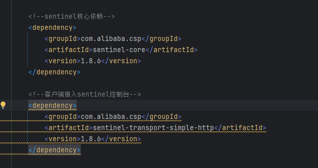

## 端口说明
nacos 默认端口 8848
sentinel 默认端口 8719  本地设置为7001
hystrix 默认端口 7979 本地服务没有用到

gateway 默认端口 9527  本地8888
consume服务 默认端口 8081
provider服务 默认端口 8082

## nacos
1、启动nacos服务   默认8848   
如果为单机模式 修改start.cmd   set MODE="standalone"    (默认是集群模式cluster)     
启动后根据服务配置 服务名（application name）

2、springboot项目添加配置信息  和依赖  

 

   

启动类添加注解  @EnableDiscoveryClient  @EnableFeignClients    启动后可以在nacos注册中心展示服务

通过RestTemplate 或  openfeign 注解 进行远程服务接口调用  
    
    @FeignClient(name = "service-provider", url = "")
    public interface RemoteConsume {

        @RequestMapping("/provider/welcome")
        String remoteConsume();
    }

controller   

    @RestController
    @RequestMapping(path = "/consume")
    public class ConsumeController {
    
        @Resource
        private RestTemplate restTemplate;
        @Resource
        private ConsumeService consumeService;
        @Autowired
        private RemoteConsume remoteConsume;
        @GetMapping(path = "/welcome")
        public String run(){
            consumeService.run();
            return remoteConsume.remoteConsume();
    //        return restTemplate.getForObject("http://service-provider/provider/welcome", String.class);
    }
    }

RestTemplate 通过@LoadBalanced注解实现负载均衡  策略暂未在配置中实现，目前使用默认的轮询策略   

    @Configuration
    public class ConsumeConfig {
    
        @Bean
        @LoadBalanced
        public RestTemplate restTemplate(){
            return new RestTemplate();
        }
    }

3、 sentinel 服务的 熔断、限流、降级    
Sentinel 的主要工作机制如下：

    对主流框架提供适配或者显示的 API，来定义需要保护的资源，并提供设施对资源进行实时统计和调用链路分析。
    根据预设的规则，结合对资源的实时统计信息，对流量进行控制。同时，Sentinel 提供开放的接口，方便您定义及改变规则。
    Sentinel 提供实时的监控系统，方便您快速了解目前系统的状态    

在限制的手段上，Sentinel 和 Hystrix 采取了完全不一样的方法。     

    Hystrix 通过线程池的方式，来对依赖(在我们的概念中对应资源)进行了隔离。这样做的好处是资源和资源之间做到了最彻底的隔离。缺点是除了增加了线程切换的成本，还需要预先给各个资源做线程池大小的分配。
    Sentinel 对这个问题采取了两种手段:
    通过并发线程数进行限制
    和资源池隔离的方法不同，Sentinel 通过限制资源并发线程的数量，来减少不稳定资源对其它资源的影响。这样不但没有线程切换的损耗，也不需要您预先分配线程池的大小。当某个资源出现不稳定的情况下，例如响应时间变长，对资源的直接影响就是会造成线程数的逐步堆积。当线程数在特定资源上堆积到一定的数量之后，对该资源的新请求就会被拒绝。堆积的线程完成任务后才开始继续接收请求。
    通过响应时间对资源进行降级
    除了对并发线程数进行控制以外，Sentinel 还可以通过响应时间来快速降级不稳定的资源。当依赖的资源出现响应时间过长后，所有对该资源的访问都会被直接拒绝，直到过了指定的时间窗口之后才重新恢复。

sentinel依赖引用    

     

启动sentinel-dashboard-1.8.7.jar          

    java -Dserver.port=7001 -Dcsp.sentinel.dashboard.server=127.0.0.1:7001 -Dproject.name=sentinel-dashboard -jar sentinel-dashboard.jar

[sentinel-dashboard-1.8.7.jar](..%2F..%2F..%2Fsoft%2Falibaba-sentinel%2Fsentinel-dashboard-1.8.7.jar)

启动服务时  jvm参数要指定控制台地址和端口号    

    -Dcsp.sentinel.dashboard.server=127.0.0.1:7001

sentinel 规则默认存储到内存  规则持久化： 1、拉模式（规则保存到本地文件）  2、推模式（通过nacos配置规则，控制台读取nacos配置信息）

先创建文件  路径和名字保持一致： 

[com.alibaba.csp.sentinel.init.InitFunc](src%2Fmain%2Fresources%2FMETA-INF%2Fservices%2Fcom.alibaba.csp.sentinel.init.InitFunc)[services](src%2Fmain%2Fresources%2FMETA-INF%2Fservices)

代码 

[FileDataSourceInit.java](src%2Fmain%2Fjava%2Forg%2Fbing%2Fserviceconsume%2Fconfig%2FFileDataSourceInit.java)

4、 nginx负载均衡
window 开启命令

    nginx -s start

关闭

    nginx -s stop

不需关闭 直接加载调整后的nginx

    nginx -s reload

负载均衡配置 nginx.conf    127.0.0.1 的 80 转发至 8081或8083端口  策略是轮询

    # upstream 自定义负载均衡服务器分组名
    upstream  server_group_name {
    server  127.0.0.1:8081;
    server  127.0.0.1:8083;
    }

    server {
        listen       80;
        server_name  127.0.0.1;

        #charset koi8-r;

        #access_log  logs/host.access.log  main;

        location / {
			# proxy_pass代理转发
			proxy_pass http://server_group_name/;
			proxy_set_header   Host             $host;
            proxy_set_header   X-Real-IP        $remote_addr;
            proxy_set_header   X-Forwarded-For  $proxy_add_x_forwarded_for;
            # root   html;
            # index  index.html index.htm;
        }
    }
